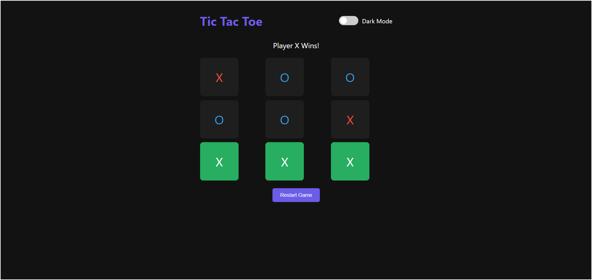

# ❌⭕ Tic Tac Toe Game

A modern Tic Tac Toe game built using **HTML**, **CSS**, and **JavaScript**, with dark/light mode support and scoreboard tracking.

---

## 🔹 Features

- 2 Player gameplay
- Win detection with highlights
- Dark/Light theme toggle
- Clean, responsive UI

---

## 🎯 How to Play

Click on the grid to make your move.  
First player is `X`, second is `O`.  
Win by completing a row, column or diagonal.

---

## 🛠️ Tech Stack

- HTML
- CSS (Custom Properties for theme)
- JavaScript (DOM manipulation)

---

## 📸 Screenshots

---

